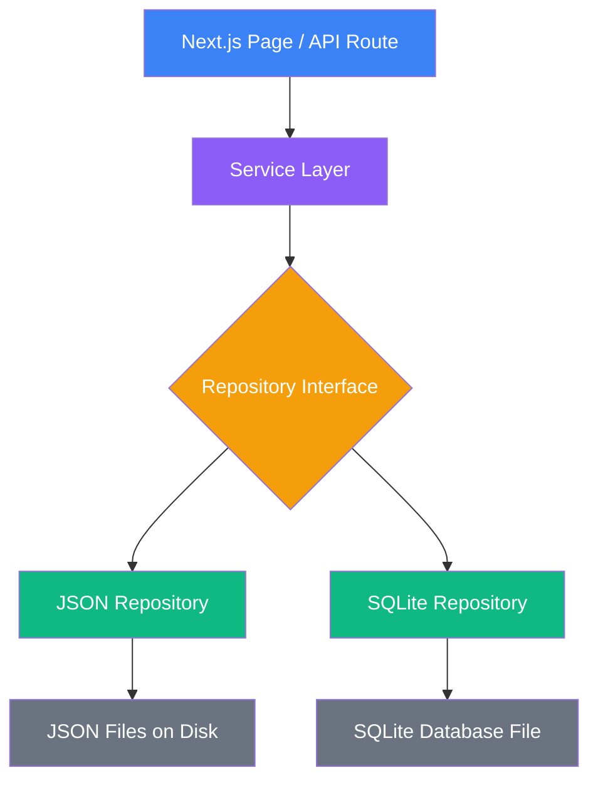
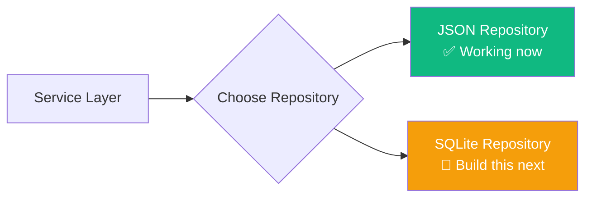
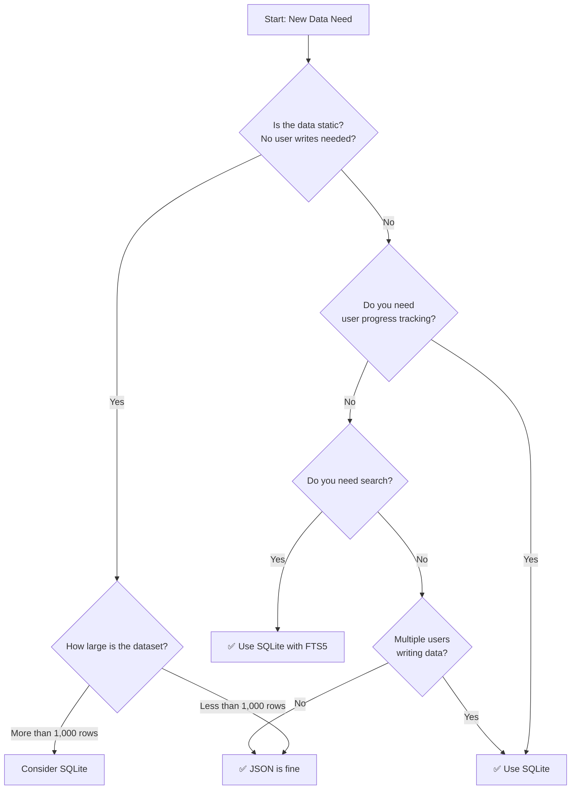
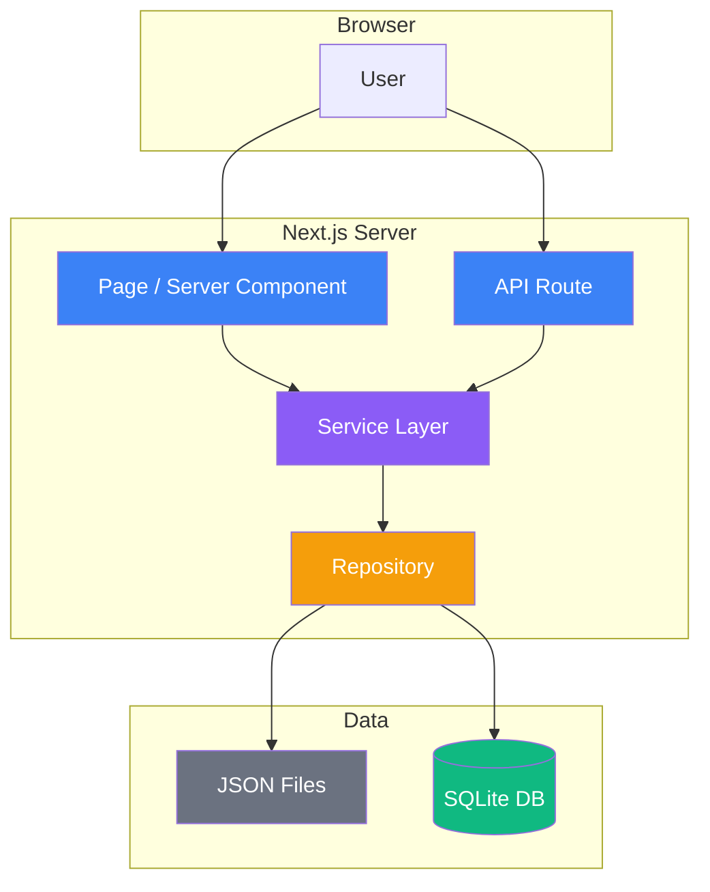
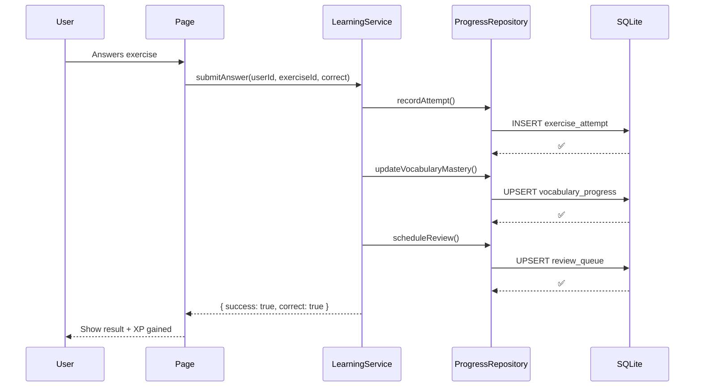
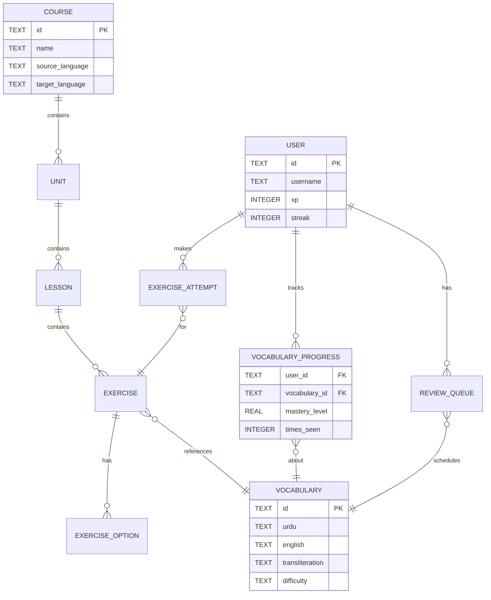

# Complete Data Layer Guide for Next.js App Router

## JSON → SQLite (better-sqlite3) · From Beginner to Production

> **Who is this guide for?**
> Beginner to intermediate developers building Next.js applications who want to learn
> how to architect a proper data layer — starting simple with JSON files and progressively
> upgrading to a production-ready SQLite database.

---

## Table of Contents

1. [What Is a Data Layer?](#1-what-is-a-data-layer)
2. [Project Architecture Overview](#2-project-architecture-overview)
3. [JSON Data Pattern — Start Simple](#3-json-data-pattern--start-simple)
4. [JSON Provider — Loading Files Safely](#4-json-provider--loading-files-safely)
5. [JSON Cache — Avoiding Repeated Reads](#5-json-cache--avoiding-repeated-reads)
6. [Repository Pattern — Isolating Data Access](#6-repository-pattern--isolating-data-access)
7. [Service Layer — Where Business Logic Lives](#7-service-layer--where-business-logic-lives)
8. [Using Data in Next.js App Router](#8-using-data-in-nextjs-app-router)
9. [Limitations of JSON](#9-limitations-of-json)
10. [Migrating to SQLite](#10-migrating-to-sqlite)
11. [Installing better-sqlite3](#11-installing-better-sqlite3)
12. [SQLite Connection Setup](#12-sqlite-connection-setup)
13. [Creating Database Tables](#13-creating-database-tables)
14. [SQLite Repository Implementation](#14-sqlite-repository-implementation)
15. [Switching Repositories Without Breaking the UI](#15-switching-repositories-without-breaking-the-ui)
16. [When to Use JSON vs SQLite](#16-when-to-use-json-vs-sqlite)
17. [Final Production Architecture](#17-final-production-architecture)
18. [Complete Example: Duolingo-Level Language Learning Database](#18-complete-example-duolingo-level-language-learning-database)

---

## 1. What Is a Data Layer?

### The Problem with "Just Read the JSON"

When most beginners build a Next.js project, they write code like this:

```tsx
// ❌ Beginner approach — works but causes problems later
import data from "@/data/vocabulary.json"

export default function Page() {
  return (
    <ul>
      {data.map(word => <li key={word.id}>{word.english}</li>)}
    </ul>
  )
}
```

This works for 10 words. But imagine your app grows:

- You add 5,000 vocabulary words
- You add search functionality
- You add user progress tracking
- You want to swap JSON for a real database

**Now every component needs to be rewritten.** This is called "tight coupling" — your UI is directly glued to your data source.

### The Clean Architecture

A **data layer** is a set of dedicated files whose only job is to read, write, and manage data. The UI never touches the database directly.

```
┌─────────────────────────────────────┐
│           UI Components             │  ← React / Next.js pages
│      (knows nothing about data)     │
└────────────────┬────────────────────┘
                 │ calls
┌────────────────▼────────────────────┐
│           Service Layer             │  ← Business logic
│    (e.g. "get top 10 words")        │
└────────────────┬────────────────────┘
                 │ calls
┌────────────────▼────────────────────┐
│          Repository Layer           │  ← Data access logic
│  (e.g. "SELECT * FROM vocabulary")  │
└────────────────┬────────────────────┘
                 │ reads/writes
┌────────────────▼────────────────────┐
│           Data Source               │  ← JSON file OR SQLite DB
└─────────────────────────────────────┘
```

> **Key insight:** When you want to switch from JSON to SQLite, you only change the Repository. The Service and UI stay exactly the same.

---

## 2. Project Architecture Overview

Here is the recommended folder structure for a Next.js App Router project:

```
my-app/
├── src/
│   ├── app/                          # Next.js App Router pages
│   │   ├── vocabulary/
│   │   │   └── page.tsx
│   │   └── api/
│   │       └── vocabulary/
│   │           └── route.ts
│   │
│   ├── data/                         # Static JSON datasets
│   │   ├── vocabulary.json
│   │   └── grammar.json
│   │
│   ├── lib/                          # Shared utilities
│   │   ├── json-db/
│   │   │   ├── json.provider.ts      # File reader
│   │   │   └── json.cache.ts         # In-memory cache
│   │   └── sqlite/
│   │       ├── database.ts           # DB connection
│   │       └── schema.sql            # Table definitions
│   │
│   ├── repositories/                 # Data access classes
│   │   ├── base.repository.ts
│   │   ├── vocabulary.repository.ts
│   │   └── sqlite-vocabulary.repository.ts
│   │
│   └── services/                     # Business logic classes
│       └── vocabulary.service.ts
│
├── database.db                       # SQLite database file
└── scripts/
    └── seed.ts                       # Database seeding script
```

### Architecture Diagram



---

## 3. JSON Data Pattern — Start Simple

### Why Start with JSON?

JSON files are perfect for beginners because:

- **Zero setup** — no database to install
- **Easy to read** — open it in VS Code and see everything
- **Version controlled** — committed to Git like code
- **Type-safe** — TypeScript can validate your data shape

### Creating Your First Dataset

Create the file `src/data/vocabulary.json`:

```json
[
  {
    "id": "v001",
    "urdu": "کتاب",
    "english": "book",
    "transliteration": "kitāb",
    "difficulty": "beginner",
    "partOfSpeech": "noun"
  },
  {
    "id": "v002",
    "urdu": "گھر",
    "english": "house",
    "transliteration": "ghar",
    "difficulty": "beginner",
    "partOfSpeech": "noun"
  },
  {
    "id": "v003",
    "urdu": "پانی",
    "english": "water",
    "transliteration": "pānī",
    "difficulty": "beginner",
    "partOfSpeech": "noun"
  }
]
```

### Define a TypeScript Interface

Before reading this data, define what shape it has. Create `src/types/vocabulary.types.ts`:

```ts
/**
 * Represents a single vocabulary word in our system.
 * This interface is shared by both the JSON and SQLite implementations.
 */
export interface VocabularyWord {
  id: string
  urdu: string
  english: string
  transliteration?: string        // Optional — not every word has one
  difficulty: "beginner" | "intermediate" | "advanced"
  partOfSpeech: "noun" | "verb" | "adjective" | "adverb" | "particle"
}
```

> **Why interfaces matter:** They ensure that whether your data comes from JSON or a database, it always has the same shape. Your UI components never need to change.

---

## 4. JSON Provider — Loading Files Safely

### The Problem with Direct Imports

You might think: "Why not just `import data from './data.json'`?"

Two reasons:

1. **Next.js bundles imports** — large JSON files increase your JavaScript bundle size
2. **Dynamic loading** — using `fs.readFile` loads the file at request time, not at build time, which is better for large datasets

### Creating the JSON Provider

Create `src/lib/json-db/json.provider.ts`:

```ts
import { promises as fs } from "fs"
import path from "path"

/**
 * JsonProvider
 *
 * A utility class responsible for loading JSON files from disk.
 * It is generic (uses TypeScript generics <T>) so it can load
 * any shape of data — vocabulary, grammar rules, lessons, etc.
 *
 * Usage:
 *   const words = await JsonProvider.load<VocabularyWord[]>("src/data/vocabulary.json")
 */
export class JsonProvider {

  /**
   * Loads a JSON file and returns it as a typed JavaScript object.
   *
   * @param filePath - Path relative to the project root (e.g. "src/data/vocabulary.json")
   * @returns A Promise that resolves to the parsed data
   */
  static async load<T>(filePath: string): Promise<T> {

    // Convert the relative path to an absolute path.
    // process.cwd() always returns the project root directory.
    // Example: "/Users/you/my-app/src/data/vocabulary.json"
    const absolutePath = path.join(process.cwd(), filePath)

    // Read the raw file contents as a UTF-8 string
    const fileContents = await fs.readFile(absolutePath, "utf8")

    // Parse the JSON string into a JavaScript object
    // The "as T" cast tells TypeScript what shape to expect
    const data = JSON.parse(fileContents) as T

    return data
  }

}
```

### How to Use It

```ts
import { JsonProvider } from "@/lib/json-db/json.provider"
import type { VocabularyWord } from "@/types/vocabulary.types"

// Load all words — TypeScript knows the result is VocabularyWord[]
const words = await JsonProvider.load<VocabularyWord[]>("src/data/vocabulary.json")

console.log(words[0].english) // "book"
```

---

## 5. JSON Cache — Avoiding Repeated Reads

### Why Caching Matters

Without a cache, every request to your page causes a disk read:

```
User visits /vocabulary  → reads vocabulary.json from disk
User visits /vocabulary  → reads vocabulary.json from disk again
User visits /vocabulary  → reads vocabulary.json from disk AGAIN
```

A simple in-memory cache solves this:

```
User visits /vocabulary  → reads from disk → stores in memory
User visits /vocabulary  → returns from memory (fast!)
User visits /vocabulary  → returns from memory (fast!)
```

### Creating the Cache

Create `src/lib/json-db/json.cache.ts`:

```ts
/**
 * JsonCache
 *
 * A simple in-memory key-value store.
 * Data is stored as long as the Node.js process is running.
 *
 * In Next.js development mode, the cache resets on hot-reload.
 * In production, it persists for the lifetime of the server process.
 */

// The Map acts as our cache storage.
// Key: the file path (e.g. "src/data/vocabulary.json")
// Value: the parsed data (any shape)
const cache = new Map<string, unknown>()

export class JsonCache {

  /**
   * Retrieve a value from the cache.
   * Returns null if not found.
   */
  static get<T>(key: string): T | null {
    const value = cache.get(key)
    return (value as T) ?? null
  }

  /**
   * Store a value in the cache.
   */
  static set<T>(key: string, value: T): void {
    cache.set(key, value)
  }

  /**
   * Remove a specific entry from the cache.
   * Useful when data is updated.
   */
  static invalidate(key: string): void {
    cache.delete(key)
  }

  /**
   * Clear all cached data.
   */
  static clear(): void {
    cache.clear()
  }

}
```

### Updating the JSON Provider with Cache

Now update `json.provider.ts` to use the cache:

```ts
import { promises as fs } from "fs"
import path from "path"
import { JsonCache } from "./json.cache"

export class JsonProvider {

  static async load<T>(filePath: string): Promise<T> {

    // Step 1: Check if data is already cached
    const cached = JsonCache.get<T>(filePath)
    if (cached !== null) {
      // Cache hit — return immediately without reading disk
      return cached
    }

    // Step 2: Cache miss — read from disk
    const absolutePath = path.join(process.cwd(), filePath)
    const fileContents = await fs.readFile(absolutePath, "utf8")
    const data = JSON.parse(fileContents) as T

    // Step 3: Store in cache for future requests
    JsonCache.set(filePath, data)

    return data
  }

}
```

---

## 6. Repository Pattern — Isolating Data Access

### What Is a Repository?

A **Repository** is a class whose only responsibility is answering questions about data:

- "Give me all vocabulary words"
- "Give me the word with id `v001`"
- "Give me all beginner words"

It does **not** contain business logic like "give me the 10 words the user hasn't studied yet" — that belongs in the Service layer.

### Defining the Repository Interface

Before writing the implementation, define the **contract** — what any repository must be able to do.

Create `src/repositories/base.repository.ts`:

```ts
/**
 * BaseRepository<T>
 *
 * An abstract base class that defines the minimum API
 * any repository must implement.
 *
 * By extending this, both JSONVocabularyRepository and
 * SQLiteVocabularyRepository are guaranteed to have the same methods.
 * This is what makes swapping them easy later.
 */
export abstract class BaseRepository<T> {

  /** Return every record */
  abstract findAll(): Promise<T[]>

  /** Return a single record by ID, or undefined if not found */
  abstract findById(id: string): Promise<T | undefined>

}
```

### JSON Repository Implementation

Create `src/repositories/vocabulary.repository.ts`:

```ts
import { JsonProvider } from "@/lib/json-db/json.provider"
import { BaseRepository } from "./base.repository"
import type { VocabularyWord } from "@/types/vocabulary.types"

/**
 * VocabularyRepository (JSON Implementation)
 *
 * Reads vocabulary data from a JSON file.
 * All data access logic is contained here.
 * The Service layer calls this class — it never reads JSON directly.
 */
export class VocabularyRepository extends BaseRepository<VocabularyWord> {

  // The path to our data file, relative to project root
  private readonly FILE_PATH = "src/data/vocabulary.json"

  /**
   * Returns all vocabulary words.
   */
  async findAll(): Promise<VocabularyWord[]> {
    return JsonProvider.load<VocabularyWord[]>(this.FILE_PATH)
  }

  /**
   * Returns a single word by its ID.
   * Returns undefined if the word doesn't exist.
   */
  async findById(id: string): Promise<VocabularyWord | undefined> {
    const words = await this.findAll()
    return words.find(word => word.id === id)
  }

  /**
   * Returns all words filtered by difficulty level.
   * Example: findByDifficulty("beginner")
   */
  async findByDifficulty(difficulty: VocabularyWord["difficulty"]): Promise<VocabularyWord[]> {
    const words = await this.findAll()
    return words.filter(word => word.difficulty === difficulty)
  }

  /**
   * Searches words by English text (case-insensitive).
   * Example: search("book") returns any word containing "book"
   */
  async search(query: string): Promise<VocabularyWord[]> {
    const words = await this.findAll()
    const lowerQuery = query.toLowerCase()
    return words.filter(word =>
      word.english.toLowerCase().includes(lowerQuery) ||
      word.transliteration?.toLowerCase().includes(lowerQuery)
    )
  }

}
```

---

## 7. Service Layer — Where Business Logic Lives

### Repository vs Service — What's the Difference?

| Concern | Repository | Service |
|---|---|---|
| "Get all words" | ✅ | ❌ |
| "Get word by ID" | ✅ | ❌ |
| "Get the 5 words user hasn't reviewed in 7 days" | ❌ | ✅ |
| "Calculate user's mastery score" | ❌ | ✅ |
| "Insert a new word" | ✅ | ❌ |

The **Repository** speaks in terms of raw data. The **Service** speaks in terms of what the user or application needs.

### Creating the Vocabulary Service

Create `src/services/vocabulary.service.ts`:

```ts
import { VocabularyRepository } from "@/repositories/vocabulary.repository"
import type { VocabularyWord } from "@/types/vocabulary.types"

// Create a single shared instance of the repository.
// This is fine in Next.js because each server instance is single-tenant.
const repo = new VocabularyRepository()

/**
 * VocabularyService
 *
 * Contains all business logic related to vocabulary.
 * Pages and API routes import from here — never from repositories directly.
 */
export class VocabularyService {

  /**
   * Get all vocabulary words.
   * Used for vocabulary list pages.
   */
  static async getAllWords(): Promise<VocabularyWord[]> {
    return repo.findAll()
  }

  /**
   * Get a single word by ID.
   * Returns null if not found (safer for UI consumption than undefined).
   */
  static async getWordById(id: string): Promise<VocabularyWord | null> {
    const word = await repo.findById(id)
    return word ?? null
  }

  /**
   * Get beginner words only.
   * Used for onboarding flows and first lessons.
   */
  static async getBeginnerWords(): Promise<VocabularyWord[]> {
    return repo.findByDifficulty("beginner")
  }

  /**
   * Search vocabulary by a query string.
   * Returns an empty array if no results.
   */
  static async searchWords(query: string): Promise<VocabularyWord[]> {
    if (!query.trim()) return []
    return repo.search(query)
  }

  /**
   * Get a random selection of N words.
   * Useful for quiz generation.
   */
  static async getRandomWords(count: number): Promise<VocabularyWord[]> {
    const all = await repo.findAll()
    // Shuffle array and take first N items
    return all
      .sort(() => Math.random() - 0.5)
      .slice(0, count)
  }

}
```

---

## 8. Using Data in Next.js App Router

### In a Server Component (Page)

Next.js App Router pages are **Server Components by default**. This means they can be `async` and call your service directly — no `useEffect`, no loading spinners, no API routes needed.

Create `src/app/vocabulary/page.tsx`:

```tsx
import { VocabularyService } from "@/services/vocabulary.service"

/**
 * VocabularyPage
 *
 * This is a React Server Component.
 * It fetches data on the server before sending HTML to the browser.
 * No loading state needed — data arrives with the page.
 */
export default async function VocabularyPage() {

  // This runs on the SERVER — safe, fast, no network request from browser
  const words = await VocabularyService.getAllWords()

  return (
    <main className="max-w-2xl mx-auto p-6">
      <h1 className="text-3xl font-bold mb-6">Vocabulary</h1>

      <div className="space-y-3">
        {words.map(word => (
          <div
            key={word.id}
            className="flex items-center justify-between p-4 border rounded-lg"
          >
            {/* Urdu — use RTL direction */}
            <span className="text-2xl" dir="rtl">{word.urdu}</span>

            <div className="text-right">
              <p className="font-medium">{word.english}</p>
              {word.transliteration && (
                <p className="text-sm text-gray-500 italic">{word.transliteration}</p>
              )}
            </div>
          </div>
        ))}
      </div>
    </main>
  )
}
```

### In an API Route

Create `src/app/api/vocabulary/route.ts`:

```ts
import { VocabularyService } from "@/services/vocabulary.service"
import { NextRequest, NextResponse } from "next/server"

/**
 * GET /api/vocabulary
 * GET /api/vocabulary?search=book
 * GET /api/vocabulary?difficulty=beginner
 */
export async function GET(request: NextRequest) {

  const { searchParams } = request.nextUrl

  const search = searchParams.get("search")
  const difficulty = searchParams.get("difficulty") as "beginner" | "intermediate" | "advanced" | null

  try {

    let words

    if (search) {
      words = await VocabularyService.searchWords(search)
    } else if (difficulty) {
      words = await VocabularyService.getBeginnerWords()
    } else {
      words = await VocabularyService.getAllWords()
    }

    return NextResponse.json({ words, count: words.length })

  } catch (error) {
    console.error("Vocabulary API error:", error)
    return NextResponse.json(
      { error: "Failed to load vocabulary" },
      { status: 500 }
    )
  }

}
```

### Dynamic Route — Single Word

Create `src/app/vocabulary/[id]/page.tsx`:

```tsx
import { VocabularyService } from "@/services/vocabulary.service"
import { notFound } from "next/navigation"

interface Props {
  params: Promise<{ id: string }>
}

export default async function WordDetailPage({ params }: Props) {
  const { id } = await params

  const word = await VocabularyService.getWordById(id)

  // If word doesn't exist, show Next.js 404 page
  if (!word) notFound()

  return (
    <div className="max-w-lg mx-auto p-6">
      <p className="text-6xl text-center mb-4" dir="rtl">{word.urdu}</p>
      <h1 className="text-3xl font-bold text-center">{word.english}</h1>
      {word.transliteration && (
        <p className="text-center text-gray-500 italic mt-2">{word.transliteration}</p>
      )}
      <span className="inline-block mt-4 px-3 py-1 bg-blue-100 text-blue-800 rounded-full text-sm">
        {word.difficulty}
      </span>
    </div>
  )
}
```

---

## 9. Limitations of JSON

JSON is great for getting started. But it has serious limitations:

### Performance Problems

```
JSON with 100 words   → fine
JSON with 1,000 words → acceptable
JSON with 10,000 words → slow startup, high memory use
JSON with 100,000 words → unacceptable
```

Every request loads the entire file into memory, even if you only need one word.

### No Real Search

```ts
// JSON "search" — loads ALL words, then filters in JavaScript
const results = words.filter(w => w.english.includes(query))
// With 50,000 words, this is slow every single time
```

SQLite's FTS5 full-text search is 100x faster for this use case.

### No Relationships

With JSON, managing related data becomes a nightmare:

```json
// You'd have to manually join these in JavaScript — very slow
vocabulary.json    → 5,000 words
examples.json      → 20,000 example sentences
user-progress.json → grows with every user action
```

### No Concurrent Writes

JSON files cannot handle multiple users writing simultaneously without data corruption. SQLite handles this safely with its WAL (Write-Ahead Logging) mode.

### Summary

| Feature | JSON | SQLite |
|---|---|---|
| Setup complexity | None | Low |
| Read speed (small data) | Fast | Fast |
| Read speed (large data) | Slow | Very fast |
| Full-text search | Manual / slow | FTS5 — instant |
| Relationships | Manual | Native (JOINs) |
| Concurrent writes | ❌ Dangerous | ✅ Safe |
| Indexes | ❌ None | ✅ Powerful |
| User-generated data | ❌ Impractical | ✅ Perfect |

---

## 10. Migrating to SQLite

### Migration Strategy

The key insight is: **you don't break anything**. You add a new repository alongside the old one and switch one line in the service.



**Migration steps:**

```
Step 1: Build SQLiteVocabularyRepository (new file)
Step 2: Seed database from JSON data (one-time script)
Step 3: Change one line in VocabularyService
Step 4: Test
Step 5: Delete JSON repository (optional — keep as fallback)
```

### Data Migration Script

Create `scripts/seed.ts`:

```ts
import Database from "better-sqlite3"
import path from "path"
import { readFileSync } from "fs"
import type { VocabularyWord } from "../src/types/vocabulary.types"

// Open the database (creates it if it doesn't exist)
const db = new Database(path.join(process.cwd(), "database.db"))

// Enable WAL mode for better performance
db.exec("PRAGMA journal_mode = WAL")
db.exec("PRAGMA foreign_keys = ON")

// Create the vocabulary table
db.exec(`
  CREATE TABLE IF NOT EXISTS vocabulary (
    id              TEXT PRIMARY KEY,
    urdu            TEXT NOT NULL,
    english         TEXT NOT NULL,
    transliteration TEXT,
    difficulty      TEXT NOT NULL DEFAULT 'beginner',
    part_of_speech  TEXT
  );
`)

// Load the JSON data
const json = readFileSync(path.join(process.cwd(), "src/data/vocabulary.json"), "utf8")
const words: VocabularyWord[] = JSON.parse(json)

// Insert all words using a prepared statement (fast and safe)
const insert = db.prepare(`
  INSERT OR REPLACE INTO vocabulary
    (id, urdu, english, transliteration, difficulty, part_of_speech)
  VALUES
    (@id, @urdu, @english, @transliteration, @difficulty, @partOfSpeech)
`)

// Use a transaction for speed — wraps all inserts in a single atomic operation
const insertMany = db.transaction((items: VocabularyWord[]) => {
  for (const item of items) {
    insert.run(item)
  }
})

insertMany(words)

console.log(`✅ Seeded ${words.length} vocabulary words into SQLite`)
db.close()
```

Run with:

```bash
npx ts-node scripts/seed.ts
```

---

## 11. Installing better-sqlite3

### Installation

```bash
npm install better-sqlite3
npm install --save-dev @types/better-sqlite3
```

> **Why `better-sqlite3` and not other options?**
>
> | Library | API Style | Speed | Complexity |
> |---|---|---|---|
> | `better-sqlite3` | Synchronous | ⚡ Fastest | Simple |
> | `sqlite3` | Callback-based | Fast | Moderate |
> | `@libsql/client` | Async | Fast | Moderate |
> | Prisma with SQLite | ORM/Async | Moderate | Complex |
>
> For Next.js server-side code, `better-sqlite3`'s synchronous API is actually ideal — it simplifies code and is extremely fast.

### Native Module Considerations

`better-sqlite3` is a **native Node.js module** — it compiles C++ code during installation. This means:

- ✅ Works on Node.js environments (Vercel, Netlify Functions, Railway)
- ✅ Works in Docker
- ⚠️ Requires the same platform for build and runtime
- ❌ Does **not** work in Edge Runtime or Cloudflare Workers

If you see build errors, ensure your Node.js version matches your deployment target:

```bash
node --version   # Check local version
# Match this in your deployment platform settings
```

---

## 12. SQLite Connection Setup

### Creating the Connection Module

Create `src/lib/sqlite/database.ts`:

```ts
import Database from "better-sqlite3"
import path from "path"

/**
 * Database Connection Singleton
 *
 * We create a SINGLE database connection and reuse it throughout the app.
 * Creating multiple connections is wasteful and can cause locking issues.
 *
 * The database file is stored at the project root: /database.db
 */

// Build the absolute path to the database file
const DB_PATH = path.join(process.cwd(), "database.db")

// Open the connection
// If the file doesn't exist, better-sqlite3 creates it automatically
const db = new Database(DB_PATH)

// ─── Performance & Integrity Settings ────────────────────────────────────────

// WAL mode: allows multiple readers + one writer simultaneously
// This dramatically improves performance under concurrent load
db.exec("PRAGMA journal_mode = WAL")

// Foreign keys are disabled by default in SQLite — we always want them on
// This enforces relational integrity (e.g. can't add a lesson to a non-existent course)
db.exec("PRAGMA foreign_keys = ON")

// Increase cache size (default is ~2MB, we set 32MB)
// More cache = faster repeated queries
db.exec("PRAGMA cache_size = -32000")

// Export the connection for use in repositories
export { db }
```

### TypeScript Types for better-sqlite3

Create `src/lib/sqlite/types.ts` to improve type safety:

```ts
/**
 * SQLite returns rows as plain objects with unknown types.
 * These row types let us cast them to known shapes.
 */

export interface VocabularyRow {
  id: string
  urdu: string
  english: string
  transliteration: string | null
  difficulty: string
  part_of_speech: string | null
}

export interface UserRow {
  id: string
  username: string
  created_at: string
  xp: number
  streak: number
}

export interface ExerciseAttemptRow {
  id: string
  user_id: string
  exercise_id: string
  correct: number       // SQLite stores booleans as 0/1
  response_time: number
  created_at: string
}
```

---

## 13. Creating Database Tables

### Schema Design Principles

Before creating tables, follow these rules:

1. **Use `TEXT` for IDs** — easier to debug than auto-increment integers, and works well with UUIDs
2. **Add `created_at` to everything** — you'll thank yourself later
3. **Use `NOT NULL` generously** — prevent bad data at the database level
4. **Add indexes on columns you search/filter by**

### Basic Schema

Create `src/lib/sqlite/schema.sql`:

```sql
-- ─── Vocabulary Table ──────────────────────────────────────────────────
CREATE TABLE IF NOT EXISTS vocabulary (
  id              TEXT    PRIMARY KEY,
  urdu            TEXT    NOT NULL,
  english         TEXT    NOT NULL,
  transliteration TEXT,
  difficulty      TEXT    NOT NULL DEFAULT 'beginner',
  part_of_speech  TEXT,
  created_at      TEXT    NOT NULL DEFAULT (datetime('now'))
);

-- ─── Full-Text Search Virtual Table ───────────────────────────────────
-- FTS5 enables lightning-fast text search across urdu and english columns
CREATE VIRTUAL TABLE IF NOT EXISTS vocabulary_fts
USING fts5(
  id UNINDEXED,      -- Include ID but don't index it for search
  english,
  transliteration,
  content=vocabulary,  -- Backed by the vocabulary table
  content_rowid=rowid
);

-- ─── Indexes ───────────────────────────────────────────────────────────
-- Index on difficulty for fast filtering
CREATE INDEX IF NOT EXISTS idx_vocabulary_difficulty
ON vocabulary(difficulty);

-- Index on part_of_speech for filtering
CREATE INDEX IF NOT EXISTS idx_vocabulary_pos
ON vocabulary(part_of_speech);
```

### Running the Schema

Create `src/lib/sqlite/migrate.ts`:

```ts
import { db } from "./database"
import { readFileSync } from "fs"
import path from "path"

/**
 * Runs all SQL in schema.sql to create tables and indexes.
 * Safe to run multiple times — uses "IF NOT EXISTS" everywhere.
 */
export function runMigrations() {
  const schemaPath = path.join(process.cwd(), "src/lib/sqlite/schema.sql")
  const sql = readFileSync(schemaPath, "utf8")
  db.exec(sql)
  console.log("✅ Database migrations complete")
}
```

---

## 14. SQLite Repository Implementation

### Building the SQLite Vocabulary Repository

Create `src/repositories/sqlite-vocabulary.repository.ts`:

```ts
import { db } from "@/lib/sqlite/database"
import { BaseRepository } from "./base.repository"
import type { VocabularyWord } from "@/types/vocabulary.types"
import type { VocabularyRow } from "@/lib/sqlite/types"

/**
 * SQLiteVocabularyRepository
 *
 * Implements the same interface as VocabularyRepository,
 * but reads data from SQLite instead of a JSON file.
 *
 * The Service layer doesn't know or care which implementation is used —
 * both provide the same methods with the same return types.
 */
export class SQLiteVocabularyRepository extends BaseRepository<VocabularyWord> {

  /**
   * Convert a raw SQLite row to our VocabularyWord type.
   * SQLite uses snake_case columns; our TypeScript uses camelCase.
   */
  private mapRow(row: VocabularyRow): VocabularyWord {
    return {
      id: row.id,
      urdu: row.urdu,
      english: row.english,
      transliteration: row.transliteration ?? undefined,
      difficulty: row.difficulty as VocabularyWord["difficulty"],
      partOfSpeech: row.part_of_speech as VocabularyWord["partOfSpeech"],
    }
  }

  /**
   * Get all vocabulary words.
   * Uses .all() to return every row.
   */
  async findAll(): Promise<VocabularyWord[]> {
    const rows = db
      .prepare("SELECT * FROM vocabulary ORDER BY english ASC")
      .all() as VocabularyRow[]

    return rows.map(row => this.mapRow(row))
  }

  /**
   * Get a single word by ID.
   * Uses .get() which returns undefined if not found.
   */
  async findById(id: string): Promise<VocabularyWord | undefined> {
    const row = db
      .prepare("SELECT * FROM vocabulary WHERE id = ?")
      .get(id) as VocabularyRow | undefined

    return row ? this.mapRow(row) : undefined
  }

  /**
   * Filter by difficulty level.
   * Uses a parameterized query — safe from SQL injection.
   */
  async findByDifficulty(difficulty: VocabularyWord["difficulty"]): Promise<VocabularyWord[]> {
    const rows = db
      .prepare("SELECT * FROM vocabulary WHERE difficulty = ? ORDER BY english ASC")
      .all(difficulty) as VocabularyRow[]

    return rows.map(row => this.mapRow(row))
  }

  /**
   * Full-text search using SQLite's FTS5.
   * Dramatically faster than JavaScript filtering over JSON.
   * Supports: exact words, prefix search (word*), phrase search ("two words")
   */
  async search(query: string): Promise<VocabularyWord[]> {
    const rows = db.prepare(`
      SELECT v.*
      FROM vocabulary v
      JOIN vocabulary_fts fts ON v.id = fts.id
      WHERE vocabulary_fts MATCH ?
      ORDER BY rank
      LIMIT 50
    `).all(query) as VocabularyRow[]

    return rows.map(row => this.mapRow(row))
  }

  /**
   * Get a random sample of N words.
   * ORDER BY RANDOM() is efficient in SQLite for small result sets.
   */
  async findRandom(count: number): Promise<VocabularyWord[]> {
    const rows = db
      .prepare("SELECT * FROM vocabulary ORDER BY RANDOM() LIMIT ?")
      .all(count) as VocabularyRow[]

    return rows.map(row => this.mapRow(row))
  }

  /**
   * Count total number of words.
   * Useful for pagination and stats.
   */
  count(): number {
    const result = db
      .prepare("SELECT COUNT(*) as count FROM vocabulary")
      .get() as { count: number }

    return result.count
  }

}
```

---

## 15. Switching Repositories Without Breaking the UI

### The Magic of the Repository Pattern

This is the entire payoff of the architecture. Here is how you switch from JSON to SQLite:

**Before (JSON):**

```ts
// src/services/vocabulary.service.ts
import { VocabularyRepository } from "@/repositories/vocabulary.repository"

const repo = new VocabularyRepository()  // ← JSON implementation
```

**After (SQLite) — change ONE line:**

```ts
// src/services/vocabulary.service.ts
import { SQLiteVocabularyRepository } from "@/repositories/sqlite-vocabulary.repository"

const repo = new SQLiteVocabularyRepository()  // ← SQLite implementation
```

**Nothing else changes.** The Service methods, the API routes, the page components — all identical.

### Using an Environment Variable to Switch

For extra flexibility, you can switch implementations based on an environment variable:

```ts
// src/services/vocabulary.service.ts
import { VocabularyRepository } from "@/repositories/vocabulary.repository"
import { SQLiteVocabularyRepository } from "@/repositories/sqlite-vocabulary.repository"
import type { BaseRepository } from "@/repositories/base.repository"
import type { VocabularyWord } from "@/types/vocabulary.types"

// In development you might prefer JSON (no db setup needed)
// In production always use SQLite
function createRepository(): BaseRepository<VocabularyWord> {
  if (process.env.DATA_SOURCE === "sqlite") {
    return new SQLiteVocabularyRepository()
  }
  return new VocabularyRepository()
}

const repo = createRepository()

export class VocabularyService {
  // ... same methods as before
}
```

Then in your `.env` file:

```env
# Development
DATA_SOURCE=json

# Production
DATA_SOURCE=sqlite
```

---

## 16. When to Use JSON vs SQLite

### Decision Guide



### Quick Reference

| Situation | Recommendation |
|---|---|
| Grammar rules for a lesson | JSON |
| 50 vocabulary words | JSON |
| 5,000 vocabulary words with search | SQLite |
| User progress tracking | SQLite |
| Quiz scoring and history | SQLite |
| Static lesson content | JSON |
| Dictionary with 100k entries | SQLite with FTS5 |
| Course metadata | JSON (small) or SQLite (large) |

---

## 17. Final Production Architecture

### Complete File Structure

```
my-language-app/
│
├── src/
│   ├── app/
│   │   ├── (learn)/                    # Route group for learning flow
│   │   │   ├── lessons/[id]/page.tsx
│   │   │   └── vocabulary/page.tsx
│   │   ├── api/
│   │   │   ├── vocabulary/route.ts
│   │   │   ├── search/route.ts
│   │   │   └── progress/route.ts
│   │   └── layout.tsx
│   │
│   ├── data/                           # Static JSON (small datasets)
│   │   ├── grammar-rules.json
│   │   └── course-structure.json
│   │
│   ├── lib/
│   │   ├── json-db/
│   │   │   ├── json.provider.ts
│   │   │   └── json.cache.ts
│   │   └── sqlite/
│   │       ├── database.ts             # Connection singleton
│   │       ├── schema.sql              # All CREATE TABLE statements
│   │       └── migrate.ts              # Run migrations on startup
│   │
│   ├── repositories/
│   │   ├── base.repository.ts
│   │   ├── vocabulary.repository.ts    # JSON implementation
│   │   ├── sqlite-vocabulary.repository.ts
│   │   └── sqlite-progress.repository.ts
│   │
│   ├── services/
│   │   ├── vocabulary.service.ts
│   │   ├── progress.service.ts
│   │   └── learning.service.ts
│   │
│   └── types/
│       ├── vocabulary.types.ts
│       └── progress.types.ts
│
├── scripts/
│   └── seed.ts                         # One-time data migration
│
├── database.db                         # SQLite file (gitignored in production)
└── .env.local
```

### Architecture Flow Diagram



---

## 18. Complete Example: Designing a Duolingo-Level Language Learning Database with SQLite + Next.js

This section builds a **production-grade database schema** and full data layer for a Duolingo-style language learning app.

### Features We'll Model

- Courses → Units → Lessons hierarchy
- Vocabulary with FTS5 search
- Multiple exercise types (multiple choice, fill-in-blank, listening)
- User progress and mastery tracking
- Spaced repetition review queue
- XP and streaks (gamification)
- Adaptive difficulty

### Complete Database Schema

```sql
-- ─────────────────────────────────────────────────────────────────────────────
-- DUOLINGO-LEVEL LANGUAGE LEARNING DATABASE SCHEMA
-- SQLite + better-sqlite3
-- ─────────────────────────────────────────────────────────────────────────────

PRAGMA journal_mode = WAL;
PRAGMA foreign_keys = ON;

-- ─── Course Structure ─────────────────────────────────────────────────────────

CREATE TABLE IF NOT EXISTS course (
  id              TEXT    PRIMARY KEY,
  name            TEXT    NOT NULL,            -- "Beginner Urdu"
  source_language TEXT    NOT NULL,            -- "en"
  target_language TEXT    NOT NULL,            -- "ur"
  description     TEXT,
  created_at      TEXT    NOT NULL DEFAULT (datetime('now'))
);

CREATE TABLE IF NOT EXISTS unit (
  id          TEXT    PRIMARY KEY,
  course_id   TEXT    NOT NULL REFERENCES course(id) ON DELETE CASCADE,
  title       TEXT    NOT NULL,                -- "Greetings & Introductions"
  position    INTEGER NOT NULL,               -- Order within the course
  created_at  TEXT    NOT NULL DEFAULT (datetime('now'))
);

CREATE TABLE IF NOT EXISTS lesson (
  id          TEXT    PRIMARY KEY,
  unit_id     TEXT    NOT NULL REFERENCES unit(id) ON DELETE CASCADE,
  title       TEXT    NOT NULL,                -- "Basic Greetings"
  difficulty  TEXT    NOT NULL DEFAULT 'beginner',
  position    INTEGER NOT NULL,
  xp_reward   INTEGER NOT NULL DEFAULT 10,
  created_at  TEXT    NOT NULL DEFAULT (datetime('now'))
);

-- ─── Vocabulary ───────────────────────────────────────────────────────────────

CREATE TABLE IF NOT EXISTS vocabulary (
  id              TEXT    PRIMARY KEY,
  urdu            TEXT    NOT NULL,
  english         TEXT    NOT NULL,
  transliteration TEXT,
  part_of_speech  TEXT,
  difficulty      TEXT    NOT NULL DEFAULT 'beginner',
  audio_url       TEXT,                        -- URL to pronunciation audio
  image_url       TEXT,                        -- Optional image for the word
  notes           TEXT,                        -- Usage notes or cultural context
  created_at      TEXT    NOT NULL DEFAULT (datetime('now'))
);

-- FTS5 virtual table for fast vocabulary search
CREATE VIRTUAL TABLE IF NOT EXISTS vocabulary_fts
USING fts5(
  id UNINDEXED,
  english,
  transliteration,
  content=vocabulary,
  content_rowid=rowid
);

-- Trigger: keep FTS index in sync when vocabulary is inserted
CREATE TRIGGER IF NOT EXISTS vocabulary_fts_insert
AFTER INSERT ON vocabulary BEGIN
  INSERT INTO vocabulary_fts(rowid, id, english, transliteration)
  VALUES (new.rowid, new.id, new.english, new.transliteration);
END;

-- Trigger: keep FTS index in sync when vocabulary is updated
CREATE TRIGGER IF NOT EXISTS vocabulary_fts_update
AFTER UPDATE ON vocabulary BEGIN
  DELETE FROM vocabulary_fts WHERE rowid = old.rowid;
  INSERT INTO vocabulary_fts(rowid, id, english, transliteration)
  VALUES (new.rowid, new.id, new.english, new.transliteration);
END;

-- ─── Exercises ────────────────────────────────────────────────────────────────

CREATE TABLE IF NOT EXISTS exercise (
  id            TEXT    PRIMARY KEY,
  lesson_id     TEXT    NOT NULL REFERENCES lesson(id) ON DELETE CASCADE,
  vocabulary_id TEXT    REFERENCES vocabulary(id),  -- Optional link to a word
  type          TEXT    NOT NULL,  -- 'multiple_choice' | 'translate' | 'listening' | 'fill_blank'
  prompt        TEXT    NOT NULL,  -- The question or instruction
  prompt_urdu   TEXT,              -- Urdu version of the prompt
  answer        TEXT    NOT NULL,  -- The correct answer
  audio_url     TEXT,              -- Audio for listening exercises
  position      INTEGER NOT NULL DEFAULT 0,
  created_at    TEXT    NOT NULL DEFAULT (datetime('now'))
);

-- Multiple choice options for exercise
CREATE TABLE IF NOT EXISTS exercise_option (
  id          TEXT    PRIMARY KEY,
  exercise_id TEXT    NOT NULL REFERENCES exercise(id) ON DELETE CASCADE,
  option_text TEXT    NOT NULL,
  is_correct  INTEGER NOT NULL DEFAULT 0  -- 0 = false, 1 = true
);

-- ─── Users ────────────────────────────────────────────────────────────────────

CREATE TABLE IF NOT EXISTS user (
  id          TEXT    PRIMARY KEY,
  username    TEXT    NOT NULL UNIQUE,
  email       TEXT    UNIQUE,
  xp          INTEGER NOT NULL DEFAULT 0,
  streak      INTEGER NOT NULL DEFAULT 0,
  last_active TEXT    NOT NULL DEFAULT (datetime('now')),
  created_at  TEXT    NOT NULL DEFAULT (datetime('now'))
);

-- ─── Progress Tracking ────────────────────────────────────────────────────────

CREATE TABLE IF NOT EXISTS exercise_attempt (
  id            TEXT    PRIMARY KEY,
  user_id       TEXT    NOT NULL REFERENCES user(id) ON DELETE CASCADE,
  exercise_id   TEXT    NOT NULL REFERENCES exercise(id),
  correct       INTEGER NOT NULL,  -- 1 = correct, 0 = incorrect
  response_time INTEGER,           -- Milliseconds to answer
  created_at    TEXT    NOT NULL DEFAULT (datetime('now'))
);

CREATE TABLE IF NOT EXISTS vocabulary_progress (
  id             TEXT    PRIMARY KEY,
  user_id        TEXT    NOT NULL REFERENCES user(id) ON DELETE CASCADE,
  vocabulary_id  TEXT    NOT NULL REFERENCES vocabulary(id),
  mastery_level  REAL    NOT NULL DEFAULT 0.0,  -- 0.0 to 1.0
  times_seen     INTEGER NOT NULL DEFAULT 0,
  times_correct  INTEGER NOT NULL DEFAULT 0,
  last_reviewed  TEXT,
  UNIQUE(user_id, vocabulary_id)
);

-- ─── Spaced Repetition ────────────────────────────────────────────────────────

CREATE TABLE IF NOT EXISTS review_queue (
  id            TEXT    PRIMARY KEY,
  user_id       TEXT    NOT NULL REFERENCES user(id) ON DELETE CASCADE,
  vocabulary_id TEXT    NOT NULL REFERENCES vocabulary(id),
  next_review   TEXT    NOT NULL,  -- ISO datetime when this should next be reviewed
  interval      INTEGER NOT NULL DEFAULT 1,  -- Days until next review
  ease_factor   REAL    NOT NULL DEFAULT 2.5,  -- SM-2 algorithm ease factor
  UNIQUE(user_id, vocabulary_id)
);

-- ─── Indexes ──────────────────────────────────────────────────────────────────

CREATE INDEX IF NOT EXISTS idx_unit_course      ON unit(course_id);
CREATE INDEX IF NOT EXISTS idx_lesson_unit      ON lesson(unit_id);
CREATE INDEX IF NOT EXISTS idx_exercise_lesson  ON exercise(lesson_id);
CREATE INDEX IF NOT EXISTS idx_attempt_user     ON exercise_attempt(user_id);
CREATE INDEX IF NOT EXISTS idx_attempt_created  ON exercise_attempt(created_at);
CREATE INDEX IF NOT EXISTS idx_progress_user    ON vocabulary_progress(user_id);
CREATE INDEX IF NOT EXISTS idx_queue_user_date  ON review_queue(user_id, next_review);
CREATE INDEX IF NOT EXISTS idx_vocab_difficulty ON vocabulary(difficulty);
```

### Complete TypeScript Data Layer

#### Types

Create `src/types/learning.types.ts`:

```ts
export interface Course {
  id: string
  name: string
  sourceLanguage: string
  targetLanguage: string
  description?: string
}

export interface Unit {
  id: string
  courseId: string
  title: string
  position: number
}

export interface Lesson {
  id: string
  unitId: string
  title: string
  difficulty: "beginner" | "intermediate" | "advanced"
  position: number
  xpReward: number
}

export interface Exercise {
  id: string
  lessonId: string
  vocabularyId?: string
  type: "multiple_choice" | "translate" | "listening" | "fill_blank"
  prompt: string
  promptUrdu?: string
  answer: string
  audioUrl?: string
  options?: ExerciseOption[]
}

export interface ExerciseOption {
  id: string
  exerciseId: string
  optionText: string
  isCorrect: boolean
}

export interface VocabularyProgress {
  userId: string
  vocabularyId: string
  masteryLevel: number    // 0.0 to 1.0
  timesSeen: number
  timesCorrect: number
  lastReviewed?: string
}

export interface ReviewQueueItem {
  userId: string
  vocabularyId: string
  nextReview: string
  interval: number
  easeFactor: number
}

export interface UserStats {
  id: string
  username: string
  xp: number
  streak: number
  lastActive: string
}
```

#### Lesson Repository

Create `src/repositories/sqlite-lesson.repository.ts`:

```ts
import { db } from "@/lib/sqlite/database"
import type { Lesson, Exercise, ExerciseOption } from "@/types/learning.types"

export class LessonRepository {

  /**
   * Get all lessons for a unit, ordered by position.
   */
  findByUnit(unitId: string): Lesson[] {
    return db.prepare(`
      SELECT * FROM lesson
      WHERE unit_id = ?
      ORDER BY position ASC
    `).all(unitId) as Lesson[]
  }

  /**
   * Get a single lesson with all its exercises and options.
   * Uses two queries for clarity (avoids complex JOIN flattening).
   */
  findByIdWithExercises(lessonId: string): (Lesson & { exercises: Exercise[] }) | null {

    const lesson = db.prepare("SELECT * FROM lesson WHERE id = ?")
      .get(lessonId) as Lesson | undefined

    if (!lesson) return null

    const exercises = db.prepare(`
      SELECT * FROM exercise
      WHERE lesson_id = ?
      ORDER BY position ASC
    `).all(lessonId) as Exercise[]

    // Load options for multiple-choice exercises
    for (const exercise of exercises) {
      if (exercise.type === "multiple_choice") {
        exercise.options = db.prepare(`
          SELECT * FROM exercise_option WHERE exercise_id = ?
        `).all(exercise.id) as ExerciseOption[]
      }
    }

    return { ...lesson, exercises }
  }

}
```

#### Progress Repository

Create `src/repositories/sqlite-progress.repository.ts`:

```ts
import { db } from "@/lib/sqlite/database"
import type { VocabularyProgress, ReviewQueueItem } from "@/types/learning.types"
import { randomUUID } from "crypto"

export class ProgressRepository {

  /**
   * Record a single exercise attempt and update XP.
   * Uses a transaction so both writes succeed or both fail.
   */
  recordAttempt(userId: string, exerciseId: string, correct: boolean, responseTime: number): void {

    const record = db.transaction(() => {

      // Insert the attempt record
      db.prepare(`
        INSERT INTO exercise_attempt (id, user_id, exercise_id, correct, response_time)
        VALUES (?, ?, ?, ?, ?)
      `).run(randomUUID(), userId, exerciseId, correct ? 1 : 0, responseTime)

      // Award XP if correct
      if (correct) {
        db.prepare("UPDATE user SET xp = xp + 5 WHERE id = ?").run(userId)
      }

    })

    record()
  }

  /**
   * Update a user's mastery level for a vocabulary word.
   * Uses UPSERT (INSERT OR REPLACE) for simplicity.
   */
  updateVocabularyMastery(userId: string, vocabularyId: string, correct: boolean): void {

    // Get current progress or create default
    const current = db.prepare(`
      SELECT * FROM vocabulary_progress
      WHERE user_id = ? AND vocabulary_id = ?
    `).get(userId, vocabularyId) as VocabularyProgress | undefined

    const timesSeen = (current?.timesSeen ?? 0) + 1
    const timesCorrect = (current?.timesCorrect ?? 0) + (correct ? 1 : 0)

    // Mastery is the ratio of correct answers, capped at 1.0
    const masteryLevel = Math.min(timesCorrect / timesSeen, 1.0)

    db.prepare(`
      INSERT INTO vocabulary_progress
        (id, user_id, vocabulary_id, mastery_level, times_seen, times_correct, last_reviewed)
      VALUES (?, ?, ?, ?, ?, ?, datetime('now'))
      ON CONFLICT(user_id, vocabulary_id) DO UPDATE SET
        mastery_level = excluded.mastery_level,
        times_seen = excluded.times_seen,
        times_correct = excluded.times_correct,
        last_reviewed = excluded.last_reviewed
    `).run(randomUUID(), userId, vocabularyId, masteryLevel, timesSeen, timesCorrect)
  }

  /**
   * Get words due for spaced repetition review.
   * Returns words where next_review <= now, ordered by most overdue first.
   */
  getDueReviews(userId: string, limit = 20): ReviewQueueItem[] {
    return db.prepare(`
      SELECT * FROM review_queue
      WHERE user_id = ? AND next_review <= datetime('now')
      ORDER BY next_review ASC
      LIMIT ?
    `).all(userId, limit) as ReviewQueueItem[]
  }

  /**
   * Schedule next review using a simplified SM-2 spaced repetition algorithm.
   *
   * If answered correctly:   interval doubles (1 → 2 → 4 → 8 days...)
   * If answered incorrectly: interval resets to 1 day
   */
  scheduleReview(userId: string, vocabularyId: string, correct: boolean): void {

    const existing = db.prepare(`
      SELECT * FROM review_queue WHERE user_id = ? AND vocabulary_id = ?
    `).get(userId, vocabularyId) as ReviewQueueItem | undefined

    let interval: number
    let easeFactor: number

    if (!existing) {
      interval = correct ? 1 : 1
      easeFactor = 2.5
    } else {
      easeFactor = existing.easeFactor
      interval = correct
        ? Math.round(existing.interval * easeFactor)
        : 1
    }

    const nextReview = new Date()
    nextReview.setDate(nextReview.getDate() + interval)

    db.prepare(`
      INSERT INTO review_queue (id, user_id, vocabulary_id, next_review, interval, ease_factor)
      VALUES (?, ?, ?, ?, ?, ?)
      ON CONFLICT(user_id, vocabulary_id) DO UPDATE SET
        next_review = excluded.next_review,
        interval = excluded.interval,
        ease_factor = excluded.ease_factor
    `).run(
      randomUUID(),
      userId,
      vocabularyId,
      nextReview.toISOString(),
      interval,
      easeFactor
    )
  }

  /**
   * Get a user's overall stats.
   */
  getUserStats(userId: string) {
    const stats = db.prepare("SELECT * FROM user WHERE id = ?")
      .get(userId) as { xp: number; streak: number; last_active: string } | undefined

    const totalAttempts = db.prepare(
      "SELECT COUNT(*) as count FROM exercise_attempt WHERE user_id = ?"
    ).get(userId) as { count: number }

    const correctAttempts = db.prepare(
      "SELECT COUNT(*) as count FROM exercise_attempt WHERE user_id = ? AND correct = 1"
    ).get(userId) as { count: number }

    const accuracy = totalAttempts.count > 0
      ? Math.round((correctAttempts.count / totalAttempts.count) * 100)
      : 0

    return {
      ...stats,
      totalAttempts: totalAttempts.count,
      accuracy,
    }
  }

}
```

#### Learning Service (Ties Everything Together)

Create `src/services/learning.service.ts`:

```ts
import { LessonRepository } from "@/repositories/sqlite-lesson.repository"
import { ProgressRepository } from "@/repositories/sqlite-progress.repository"
import { SQLiteVocabularyRepository } from "@/repositories/sqlite-vocabulary.repository"

const lessonRepo = new LessonRepository()
const progressRepo = new ProgressRepository()
const vocabRepo = new SQLiteVocabularyRepository()

export class LearningService {

  /**
   * Start a lesson — returns the lesson with all exercises populated.
   */
  static startLesson(lessonId: string) {
    return lessonRepo.findByIdWithExercises(lessonId)
  }

  /**
   * Submit an exercise answer.
   * Records the attempt, updates mastery, schedules review.
   */
  static submitAnswer(
    userId: string,
    exerciseId: string,
    vocabularyId: string | undefined,
    correct: boolean,
    responseTime: number
  ) {
    // Record the raw attempt
    progressRepo.recordAttempt(userId, exerciseId, correct, responseTime)

    // If this exercise is linked to a vocabulary word, update mastery
    if (vocabularyId) {
      progressRepo.updateVocabularyMastery(userId, vocabularyId, correct)
      progressRepo.scheduleReview(userId, vocabularyId, correct)
    }

    return { success: true, correct }
  }

  /**
   * Get today's review session.
   * Returns vocabulary words due for spaced repetition review.
   */
  static async getReviewSession(userId: string) {
    const dueItems = progressRepo.getDueReviews(userId, 20)

    // Load full vocabulary data for each due item
    const words = await Promise.all(
      dueItems.map(item => vocabRepo.findById(item.vocabularyId))
    )

    return words.filter(Boolean) // Remove any undefined
  }

  /**
   * Search the vocabulary dictionary.
   */
  static async searchDictionary(query: string) {
    return vocabRepo.search(query)
  }

  /**
   * Get a user's progress dashboard data.
   */
  static getUserDashboard(userId: string) {
    return progressRepo.getUserStats(userId)
  }

}
```

#### API Routes for the Learning App

Create `src/app/api/lesson/[id]/route.ts`:

```ts
import { LearningService } from "@/services/learning.service"
import { NextRequest, NextResponse } from "next/server"

export async function GET(
  request: NextRequest,
  { params }: { params: Promise<{ id: string }> }
) {
  const { id } = await params
  const lesson = LearningService.startLesson(id)

  if (!lesson) {
    return NextResponse.json({ error: "Lesson not found" }, { status: 404 })
  }

  return NextResponse.json(lesson)
}
```

Create `src/app/api/submit/route.ts`:

```ts
import { LearningService } from "@/services/learning.service"
import { NextRequest, NextResponse } from "next/server"

export async function POST(request: NextRequest) {
  const body = await request.json()

  const { userId, exerciseId, vocabularyId, correct, responseTime } = body

  const result = LearningService.submitAnswer(
    userId,
    exerciseId,
    vocabularyId,
    correct,
    responseTime
  )

  return NextResponse.json(result)
}
```

### The Adaptive Learning Flow



### Entity Relationship Diagram



---

## Deployment Notes for Vercel / Netlify

### Important: SQLite on Serverless Platforms

Vercel and Netlify run your code in **ephemeral serverless functions**. This means:

- ✅ **Reading** from SQLite works perfectly
- ⚠️ **Writing** to SQLite may not persist between deployments

**Recommended approach for production:**

1. **Treat SQLite as read-heavy** — build your database during the CI/CD deploy step
2. **Use the build script** (`scripts/seed.ts`) to populate the database from JSON
3. **For user writes** (progress, scores) — consider a managed database like [Turso](https://turso.tech/) (libSQL, SQLite-compatible) or [PlanetScale](https://planetscale.com/)

### Vercel Configuration

In `next.config.ts`:

```ts
const nextConfig = {
  // Required for better-sqlite3 (native module)
  experimental: {
    serverComponentsExternalPackages: ["better-sqlite3"],
  },
}

export default nextConfig
```

### Build Command

In `package.json`:

```json
{
  "scripts": {
    "build": "npm run db:seed && next build",
    "db:seed": "npx ts-node --project tsconfig.scripts.json scripts/seed.ts"
  }
}
```

---

*End of Guide — Happy building! 🚀*
